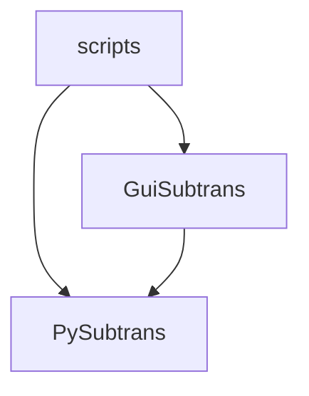

# LLM-Subtrans Architecture


```mermaid
graph TD
    Scripts[scripts] --> GuiSubtrans[GuiSubtrans]
    Scripts --> PySubtrans[PySubtrans]
    GuiSubtrans --> PySubtrans
```

This document helps developers understand where to find code and how components interact when working on the codebase.

## Entry Points

| Script | Purpose |
|--------|---------|
| `scripts/gui-subtrans.py` | Launches GUI, loads persistent settings, initializes translation providers |
| `scripts/llm-subtrans.py` | CLI translator - loads subtitle file, translates using specified provider/model, saves results |

## Module Structure

### PySubtrans (Core Engine)
Contains all subtitle processing, translation logic, and project management. This is where you'll find:
- Translation algorithms and providers
- Project state management
- Settings and configuration
- File format support and parsing

**Key Classes:**
- `Subtitles` – container for subtitle data with thread-safe access patterns
- `SubtitleScene`, `SubtitleBatch` – hierarchical organization splitting files into manageable translation units
- `SubtitleLine` – represents individual subtitles with timing, text, and translation data
- `Options` – centralized settings management
- `SubtitleProject` – orchestrator managing translation sessions and project persistence
- `SubtitleTranslator` – executes translation jobs, handles retries and errors
- `TranslationProvider` – base class for pluggable backends (OpenAI, Anthropic, etc.)
- `SubtitleBuilder` – fluent API for programmatically building subtitle structures
- `SubtitleEditor` – handles mutation operations on subtitle data with thread safety

### Shared Helpers
`PySubtrans/Helpers/` holds the cross-cutting utilities. **Check here before writing a new utility function** - most common string, time and parsing operations already exist.
- `Text` – text manipulation and script-aware rules: whitespace and punctuation normalisation, break/split sequences for long lines, dialog markers, filler words, xml-like tag extraction, token joining (`JoinWords` / `NeedsSpace` handle CJK vs Latin spacing) and RTL detection.
- `Time` – `timedelta` parsing and formatting, including SRT timestamps.
- `Parse` – key/value pairs, name lists, numeric coercion, and retry-delay/error-message extraction from provider responses.
- `SubtitleHelpers` – operations that need `SubtitleLine`: insert-or-replace by number, merging lines, merging translations back onto originals.
- `ContextHelpers` – assembles batch context and history for translation prompts.
- `Localization` – the `_()` and `tr()` gettext wrappers plus locale discovery.
- `Languages` – language name and BCP-47 tag resolution via Babel locales.
- `InstructionsHelpers` – loading and saving instruction files from bundled resources or the user config directory.
- `Resources` – config directory and resource path resolution, handling portable and frozen builds.
- `TestCases` / `Tests` – `LoggedTestCase`, `SubtitleTestCase` and the `assertLogged*` assertions used by the unit tests, dummy subtitle/provider builders, and `skip_if_debugger_attached`.
- `Color`, `Version`, `__init__` – smaller odds and ends: colour serialisation, version comparison, input/output path derivation and enum value naming.

### Subtitle Format Handling
Subtitle files are processed through a pluggable system:
- `SubtitleFileHandler` implementations read and write specific formats while exposing a common interface.
- `SubtitleFormatRegistry` loads handlers from `PySubtrans/Formats/` and maps file extensions to the appropriate handler based on priority.
- `SubtitleProject` uses the registry to detect formats from filenames and can convert subtitles when the output extension differs from the source.

### Transcription Pipeline
Media-to-subtitles transcription lives under `PySubtrans/Transcription/` and mirrors the translation provider split:
- `TranscriptionProvider` / `TranscriptionClient` – pluggable speech-to-text backends (`PySubtrans/Transcription/Providers/`), returning a `TranscriptionResult` per audio chunk with optional word timings or sub-segments.
- `AudioExtractor` / `AudioChunker` – ffmpeg-backed track listing, audio reading, silence detection and chunk planning (`PlanChunksStream` yields chunks while silence detection is still running).
- `TranscriptionLines` – `TranscriptionLineBuilder` turns a transcribed chunk into timed subtitle lines. Words are cut into utterances at pauses, speaker changes and sentence punctuation; utterances exceeding the `max_characters` / `max_line_duration` options are split at their best pause (pause length weighted by centrality, with clause-punctuation bonuses and `min_split_chars` guarding fragments) rather than stranding a short tail. Also rebases provider sub-segments and merges slivers. Pure logic with no provider or audio dependencies.
- `TranscriptionCoordinator` – end-to-end orchestration: plans chunks, transcribes each with the client, applies the resume/abort/failure policy and returns a `TranscriptionOutcome` (status, subtitles, error, line count, cost). Expected failures are reported as a FAILED outcome rather than raised. Emits `TranscriptionEvents` signals (`progress`, `audio_progress`, `segment`) during the run. `TranscriptionProvider.ResolveProviderSettings` merges shared credentials into the `"<name> Transcription"` settings namespace.

### Frozen Qwen Local Packaging

Packaged builds bundle Qwen ASR and its supporting Python libraries but exclude
`torch`, `torchgen`, and Torch native payloads. A compatible Torch installation is
provided externally and loaded in-process before Qwen's lazy import. The external
installation must match the frozen application's Python ABI, operating system, and
architecture; changing it after Torch has been imported requires an application
restart. The distribution does not bundle `ffmpeg` or `ffprobe`; those remain
external executables resolved from PATH or the configured ffmpeg path.

Distribution scripts install/check Torch before the Qwen extra and link to the
official PyTorch installation selector rather than maintaining hardware-specific
wheel recipes. Dependency-audit checks remain a release gate, including findings
from bundled Transformers and Accelerate.

After PyInstaller completes, the distro scripts run
`scripts/prepare_external_torch.py --metadata-only`, writing
`frozen-python-compatibility.json` into the frozen application's
`_internal/assets/` directory (PyInstaller 6+ layout). At runtime, the metadata
is located via `GetResourcePath("assets", METADATA_FILENAME)`, which resolves
through `sys._MEIPASS` in frozen builds and `./assets/` in development. The
helper's `--prepare-external-dir` and `--validate-external-dir` modes operate on
a complete user-managed venv/site-packages location; they never reconstruct
package or native dependency files. Users selecting a hardware build should use
the official PyTorch selector.

Both external setup modes require `--frozen-metadata` pointing to the frozen
application's JSON. Schema version 1 uses `compatibility` fields
`python_implementation`, `python_abi`, `python_version` (major.minor), `os`,
`architecture`, and `pointer_bits`. The helper compares the external interpreter's
facts to those fields using a 15-second `-I -S` subprocess probe, bypassing site
initialization and `.pth` execution. Venv roots resolve Windows `Lib/site-packages`
and POSIX `lib/pythonX.Y/site-packages`; a root containing `torch` or a
`site-packages` child is also recognized. The validation command requires a venv
interpreter and checks directory presence and compatibility, not Torch import or
native dependency readiness. PyInstaller failure stops every distro script before
metadata generation.

#### Torch Subpackage (`PySubtrans/Transcription/Torch/`)

Three modules that handle external Torch installations live in their own
subpackage. None import Torch or Qt — only stdlib and `PySubtrans.Helpers`.

| Module | Responsibility |
|--------|----------------|
| `Hardware.py` | GPU detection (NVIDIA/AMD/Intel/Apple Silicon), CUDA driver version matching, PyTorch index URL selection |
| `Validation.py` | ABI compatibility metadata — stamping, reading, and checking frozen-build compatibility |
| `Runtime.py` | Loads an external Torch venv at runtime (`sys.path` + DLL registration), validates compatibility first |

Consumers:

| Consumer | Imports from |
|----------|-------------|
| `TorchSetupDialog.py` (GUI wizard) | `Hardware` (detection, index URLs), `Validation` (ABI checking) |
| `prepare_external_torch.py` (build tool) | `Validation` (metadata stamping and venv probing) |
| `install_torch.py` (installer) | `Hardware` (detection for pre-install torch variant selection) |
| `Provider_QwenLocal.py` / `QwenLocalClient.py` | `Runtime` (config option sentinel, runtime loader) |
| `SettingsDialog.py` | `Runtime` (`TorchConfigOption` sentinel) |

Key `Validation` functions:
- **`normalise_architecture()`** — merged alias table covering both x86 and ARM variants
- **`candidate_site_packages_paths()` / `find_torch_site_packages()`** — canonical site-packages resolution for all layout variants
- **`build_current_compatibility()`** — builds the 6-field compatibility dict from the running interpreter
- **`find_compatibility_metadata()`** — locates the metadata file via `GetResourcePath`
- **`read_compatibility_metadata()` / `check_compatibility()`** — reads and validates metadata, with an `error_type` parameter so each consumer raises its own exception type

Key `Hardware` functions:
- **`DetectHardware()`** — main entry point: returns a `HardwareDetection` with description, index URL, and GPU flag
- **`SelectCudaBuild()`** — matches a driver version against the CUDA toolkit table
- **`DetectNvidiaDriver()` / `DetectNvidiaCudaVersion()`** — nvidia-smi queries
- **`DetectGpuHardware()`** — vendor scan via wmic/lspci when no driver toolkit is available

The CLI entry point is `scripts/transcribe.py`; the GUI runs the same coordinator through `TranscribeMediaCommand`.

### GuiSubtrans (User Interface)
PySide6-based interface using MVVM pattern. Work here for UI features, dialogs, and user interactions.

### Key Classes
- `ProjectDataModel` – State management and synchronization layer
- `ProjectViewModel` – Qt model mapping project data to UI views (scenes → batches → lines)
- `CommandQueue` – executes operations asynchronously with undo/redo support
- `GuiSubtrans/Widgets/*` - Various custom widgets for forms, editors, and views

## Data Organization

### Data Hierarchy
- `Subtitles` – top-level container with subtitle content and metadata, provides thread-safe access to scenes and lines
- `SubtitleScene` – a time-sliced section of subtitles, grouped into batches
- `SubtitleBatch` – groups of lines within a scene, split into chunks for translation
- `SubtitleLine` – individual subtitle with index, timing, text and metadata

### SubtitleProject
Manages translation sessions and project persistence. It orchestrates loading subtitle files, saving/loading `.subtrans` project files (JSON format containing subtitles, translations, and metadata), and coordinates project settings management.

### SubtitleBatcher
Pre-processes subtitles to divide them into scenes and batches ready for translation. Scene detection threshold and maximum batch size are configurable.

### SubtitleBuilder
The `SubtitleBuilder` class provides a fluent API for constructing `Subtitles`.
- Automatic scene and batch organization based on configurable size limits
- Integration with `SubtitleBatcher` for intelligent scene subdivision

### SubtitleEditor
Mutation operations on subtitle data should go through the `SubtitleEditor` class to ensure proper thread safety when adding/removing/merging/splitting scenes, batches and lines.

Also provides methods for preprocessing, auto-batching and data sanitization.

## Translation Process

**SubtitleTranslator** manages the translation pipeline:
- Builds prompts with context for each batch of subtitles
- Delegates to `TranslationProvider` clients for API calls
- Handles retries, error management and post-processing
- Emits `TranslationEvents` with progress updates

### TranslationProvider System
- Pluggable base class with providers in `PySubtrans/Providers/` that register at startup
- Each provider exposes available models and creates an appropriate `TranslationClient`
- `TranslationClient` handles API communication specifics (authentication, request format, parsing)
- The provider can also provide a custom `TranslationParser` if a non-standard response format is expected
   
## Command-Line Architecture

The command-line interface provides simple synchronous processing of a source file.

1. **Argument parsing** – allows configuration via command line arguments.
2. **Options creation** – Parsed arguments and environment variables are merged to produce an `Options` instance that configures the translation flow.
3. **Project initialization** – `CreateProject` loads the source subtitles and prepares them for translation, and initialises a `SubtitleTranslator`, optionally reading/writing a project file.
5. **Completion** the resulting translation is saved, and the optional project file is updated.

## GUI Architecture

The GUI is built using PySide6 and follows a Model-View-ViewModel (MVVM) like pattern.

### ProjectDataModel
This class acts as a bridge between the core `SubtitleProject` and the `ProjectViewModel`. It holds the current project, the project options, and the current translation provider. It's responsible for creating the `ProjectViewModel` and for applying updates to it.

### ProjectViewModel
A custom `QStandardItemModel` that serves as the source for the various views in the GUI. It holds a tree of `SceneItem`, `BatchItem`, and `LineItem` objects, which mirror the structure of the `Subtitles` data.

It has an update queue to handle asynchronous updates, ensuring that the GUI is updated in a thread-safe manner.

### Views
The GUI is composed of several views, such as the `ScenesView`, `SubtitleView`, and `LogWindow`, which are all subclasses of `QWidget`. 

These views are responsible for displaying the data from the `ProjectViewModel` and for handling user input.

### Command Queue
GUI operations use the Command pattern for background execution and undo/redo support:

- **CommandQueue** – executes commands on background `QThreadPool`, manages concurrency and synchronisation
- **Commands** – in `GuiSubtrans/Commands/`, encapsulate operations (translation, file I/O, etc.)
- Follow-up commands inherit their parent data model by default. Standalone file-only commands can opt out of data-model updates so their completion cannot replace the active GUI model.
- **Undo/Redo** – maintained via `undo_stack` and `redo_stack`

## Settings Management
Application settings are managed through a layered system:

**`SettingsType`** - generic type-safe settings container
- Provides typed getters (`get_str`, `get_int`, `get_bool`) and convenience properties

**`PySubtrans.Options`** 
- application-specific `SettingsType`
- Provides default values for all application settings
- Loads settings from a `settings.json` file
- Import settings from environment variables and command line arguments
- Supports project-specific and provider-specific settings

## GUI Widget Architecture

### The `ModelView`
The central widget for displaying project data is the `GuiSubtrans.Widgets.ModelView`. It is a container widget that uses a `QSplitter` to arrange three main components:

#### `ProjectSettings`
A form for editing project-specific settings. It is displayed when the user clicks on the "Settings" button in the `ProjectToolbar`.

#### ScenesView
A `QTreeView` that displays the scenes and batches from the `ProjectViewModel`. This lets users view the high level status of a translation job.

#### ContentView
A container widget that dynamically adapts based on the selected scene(s) and batch(es), to show:

**`SubtitleView`** individual lines, aligning original and translated content.

**`SelectionView`** provides contextual information and actions.

#### Editors and Dialogs
`GuiSubtrans.Widgets.Editors` contains various widgets for editing scenes, batches, and individual subtitle lines, shown when a user double-clicks on an item in the `ScenesView` or `SubtitleView`. 

### Settings Dialog Architecture

`SettingsDialog` provides access to the global and provider-specific configuration settings.

#### Schema-driven UI
The structure of the `SettingsDialog` is defined by the `SECTIONS` dictionary, which defines the tabs and their contents as a nested dictionary of setting keys and their types along with an optional tooltip. e.g.

```python
'General': {
    'ui_language': (str, _("The language of the application interface")),
    'target_language': (str, _("The default language to translate the subtitles to")),
    # ...
},
```

This structure is used to build the form, with the `OptionsWidgets.CreateOptionWidget` factory function creating an appropriate widget for each setting based on its type.

#### Conditional visibility
Settings can be conditionally visible on other settings, using a data-driven system defined by the `VISIBILITY_DEPENDENCIES` property.

#### Provider pluggability
The "Provider Settings" tab dynamically populates with options specific to the selected translation provider. Each provider defines its own settings schema via a virtual `GetOptions` method, which is then used to populate the form.

## Real-time UI Updates
Translation operations can take minutes, but users need feedback and the ability to continue working.

### ModelUpdate Pattern
Commands can send incremental UI updates during execution via `ModelUpdate` objects.

For example, `TranslateSceneCommand` subscribes to `SubtitleTranslator` events. Each time a batch completes, it emits a `ModelUpdate` with the translation data.

1. Command creates `ModelUpdate` and sends to `ProjectDataModel`
2. `ProjectDataModel` queues update and emits `updatesPending` signal
3. `ProjectViewModel.ProcessUpdates()` applies changes on main thread
4. Views automatically reflect updated data through Qt's model/view system

**For detailed flow diagrams**, see [translation-flow.md](translation-flow.md) which includes:
- Complete sequence diagram from user action to UI update
- Class diagram showing component relationships
- State diagram for command lifecycle
- Data flow diagram for ModelUpdate processing
- Component interaction diagram showing threading model

## Translation Provider Architecture
The application supports multiple translation services through a provider system.

### TranslationProvider (Configuration Layer)
Each `TranslationProvider` subclass serves as the registry entry for a translation service and offers:

- **`available_models`**: property containing available models that can be selected
- **GetTranslationClient**: creates an appropriate client for API communication
- **GetOptions**: Defines provider-specific options (API key, endpoints, etc.)

### TranslationClient (Communication Layer)
The `TranslationClient` defines the API communication interface:

- **`BuildTranslationPrompt()`** – constructs the prompt sent to the translation service
- **`RequestTranslation()`** – handles the API call and returns a `Translation` object
- **`GetParser()`** – returns a `TranslationParser` to extract translated text from the response
- **`supports_streaming`** – property indicating if the client supports streaming responses

#### Streaming Response Support
Several translation clients support streaming responses for real-time translation updates:

**Supported Providers:**
- **OpenAI (Reasoning Models)** (`OpenAIReasoningClient`) - Uses OpenAI's streaming API with event-based response handling
- **Claude** (`AnthropicClient`) - Supports streaming via Anthropic's streaming API
- **Gemini** (`GeminiClient`) - Uses Google's streaming response format
- **Custom Server** (`CustomClient`) - Handles Server-Sent Events (SSE) with robust parsing
- **OpenRouter/DeepSeek** (`OpenRouterClient`, `DeepSeekClient`) - `CustomClient` with streaming support

**Streaming Architecture:**
- **`TranslationRequest`** class encapsulates streaming state and logic to maintain stateless clients
- **Event-driven updates** via `batch_updated` signal for partial translations
- **Delta accumulation** processes streaming text chunks and detects complete line groups

**Key Methods:**
- **`ProcessStreamingDelta(delta_text)`** – processes incoming streaming text chunks
- **`_emit_partial_update()`** – emits partial translation updates to the GUI
- **`_has_complete_line_group()`** – detects when enough content has accumulated for an update

**Configuration:**
Streaming can be enabled via provider settings:
- `stream_responses` (bool) setting appears in provider options for supported clients
- Streaming is opt-in and gracefully falls back to non-streaming for unsupported models

### Adding New Providers
To add a new provider:
1. Create a new module in `PySubtrans/Providers/` with a `TranslationProvider` subclass
2. Add an import statement for the new module in `PySubtrans/Providers/__init__.py`

The provider will then automatically register at startup and its settings will be added to `SettingsDialog`.

### Prompt Construction and Response Parsing
The specific format for translation requests can vary by provider and responses can be inconsistent, so two helper classes exist to manage the differences between capabilities and expectations.

**`TranslationPrompt`** builds context-rich prompts by combining:
- User instructions and translation guidelines
- Subtitle lines to be translated  
- Scene/batch summaries and character information for context
- Configurable templates

**`TranslationParser`** extracts translations from LLM responses:
- Uses multiple regex patterns to attempt to extract translated lines from the response
- Matches extracted translations back to source subtitle lines
- Extracts additional metadata
- Validates results (line length, formatting rules) and triggers retries if needed

## Extending the System

- **New file formats** → `PySubtrans/Formats/` (add file handler, extend `SubtitleFileHandler`, add import to `__init__.py`)
- **Translation providers** → `PySubtrans/Providers/` (subclass `TranslationProvider` and `TranslationClient`, add import to `__init__.py`)
- **Transcription providers** → `PySubtrans/Transcription/Providers/` (subclass `TranscriptionProvider` and `TranscriptionClient`)
- **GUI features** → `GuiSubtrans/Widgets/` (new views/dialogs), `GuiSubtrans/Commands/` (new operations)
- **Settings** → update `Options` schema, add to `SettingsDialog.SECTIONS`
- **Background operations** → implement `Command` pattern in `GuiSubtrans/Commands/` for thread safety and undo support

**Key principles:**
- All operations that modify project data must go through the `CommandQueue` to maintain thread safety and undo/redo functionality.
- All subtitle mutations should use a `SubtitleEditor` for lock management.
