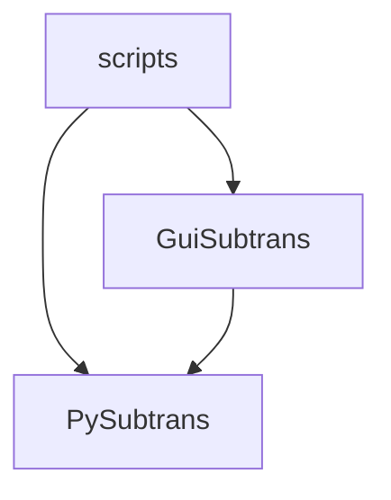

# LLM-Subtrans Architecture


```mermaid
graph TD
    Scripts[scripts] --> GuiSubtrans[GuiSubtrans]
    Scripts --> PySubtrans[PySubtrans]
    GuiSubtrans --> PySubtrans
```

This document helps developers understand where to find code and how components interact when working on the codebase.

## Contents

- [Entry Points](#entry-points) – CLI and GUI launch scripts
- [Module Structure](#module-structure) – PySubtrans core, shared helpers, format handling, transcription pipeline
- [Data Organization](#data-organization) – subtitle data hierarchy and the classes that manage it
- [Translation Architecture](#translation-architecture) – translation pipeline, provider/client layers, prompt/parser, streaming
- [Command-Line Architecture](#command-line-architecture) – CLI processing flow
- [Settings Management](#settings-management) – `SettingsType` / `Options` layering
- [GUI Architecture](#gui-architecture) – MVVM layer, views, command queue, real-time updates, settings dialog
- [Extending the System](#extending-the-system) – where to add new formats, providers, GUI features, settings

## Entry Points

| Script | Purpose |
|--------|---------|
| `scripts/gui-subtrans.py` | Launches GUI, loads persistent settings, initializes translation providers |
| `scripts/llm-subtrans.py` | CLI translator - loads subtitle file, translates using specified provider/model, saves results |

## Module Structure

### PySubtrans (Core Engine)
Contains all subtitle processing, translation logic, and project management. This is where you'll find:
- Translation algorithms and providers
- Project state management
- Settings and configuration
- File format support and parsing

**Key Classes:**
- `Subtitles` – container for subtitle data with thread-safe access patterns
- `SubtitleScene`, `SubtitleBatch` – hierarchical organization splitting files into manageable translation units
- `SubtitleLine` – represents individual subtitles with timing, text, and translation data
- `Options` – centralized settings management
- `SubtitleProject` – orchestrator managing translation sessions and project persistence
- `SubtitleTranslator` – executes translation jobs, handles retries and errors
- `TranslationProvider` – base class for pluggable backends (OpenAI, Anthropic, etc.)
- `SubtitleBuilder` – fluent API for programmatically building subtitle structures
- `SubtitleEditor` – handles mutation operations on subtitle data with thread safety

### Shared Helpers
`PySubtrans/Helpers/` holds the cross-cutting utilities. **Check here before writing a new utility function** - most common string, time and parsing operations already exist.
- `Text` – text manipulation and script-aware rules: whitespace and punctuation normalisation, break/split sequences for long lines, dialog markers, filler words, xml-like tag extraction, token joining (`JoinWords` / `NeedsSpace` handle CJK vs Latin spacing) and RTL detection.
- `Time` – `timedelta` parsing and formatting, including SRT timestamps.
- `Parse` – key/value pairs, name lists, numeric coercion, and retry-delay/error-message extraction from provider responses.
- `SubtitleHelpers` – operations that need `SubtitleLine`: insert-or-replace by number, merging lines, merging translations back onto originals.
- `ContextHelpers` – assembles batch context and history for translation prompts.
- `Localization` – the `_()` and `tr()` gettext wrappers plus locale discovery.
- `Languages` – language name and BCP-47 tag resolution via Babel locales.
- `InstructionsHelpers` – loading and saving instruction files from bundled resources or the user config directory.
- `Resources` – config directory and resource path resolution, handling portable and frozen builds.
- `TestCases` / `Tests` – `LoggedTestCase`, `SubtitleTestCase` and the `assertLogged*` assertions used by the unit tests, dummy subtitle/provider builders, and `skip_if_debugger_attached`.
- `Color`, `Version`, `__init__` – smaller odds and ends: colour serialisation, version comparison, input/output path derivation and enum value naming.

### Subtitle Format Handling
Subtitle files are processed through a pluggable system:
- `SubtitleFileHandler` implementations read and write specific formats while exposing a common interface.
- `SubtitleFormatRegistry` loads handlers from `PySubtrans/Formats/` and maps file extensions to the appropriate handler based on priority.
- `SubtitleProject` uses the registry to detect formats from filenames and can convert subtitles when the output extension differs from the source.

### Transcription Pipeline
Media-to-subtitles transcription lives under `PySubtrans/Transcription/` and mirrors the translation provider split:
- `TranscriptionProvider` / `TranscriptionClient` – pluggable speech-to-text backends (`PySubtrans/Transcription/Providers/`), returning a `TranscriptionResult` per audio chunk with optional word timings or sub-segments.
- `AudioExtractor` / `AudioChunker` – ffmpeg-backed track listing, audio reading, silence detection and chunk planning (`PlanChunksStream` yields chunks while silence detection is still running).
- `TranscriptionLines` – `TranscriptionLineBuilder` turns a transcribed chunk into timed subtitle lines. Provider sub-segments (parts) are the lines when a provider returns them; otherwise parts are derived from the chunk transcript. The transcript is always the text, and word timings (matched to it by `AlignWords`) only time and split the parts. With words but no transcript, words are grouped into utterances instead. Brief slivers and overlapping lines are then merged. A provider's `word_coverage` gates heuristics that only suit engines whose words miss stretches of the transcript. Pure logic with no provider or audio dependencies.
- `TranscriptionCoordinator` – end-to-end orchestration: plans chunks, transcribes each with the client, applies the resume/abort/failure policy and returns a `TranscriptionOutcome` (status, subtitles, error, line count, cost). Expected failures are reported as a FAILED outcome rather than raised. Emits `TranscriptionEvents` signals (`progress`, `audio_progress`, `segment`) during the run. `TranscriptionProvider.ResolveProviderSettings` merges shared credentials into the `"<name> Transcription"` settings namespace.

The CLI entry point is `scripts/transcribe.py`; the GUI runs the same coordinator through `TranscribeMediaCommand`.

For tuning line assembly, `transcribe.py --capture PATH` (or the `TRANSCRIPTION_CAPTURE_PATH` environment variable) makes `TranscriptionCapture` write each chunk's raw provider segment to JSON before the line builder sees it. `scripts/replay_transcription.py` replays a capture through `TranscriptionLineBuilder` with overridden settings, so changes can be measured without transcribing again. It reports short lines, stacked lines and word-order statistics, sweeps a setting with `--compare`, and writes subtitles with `--output`.

One provider, `Provider_QwenLocal`, runs ASR locally via a packaged/external Torch install rather than a hosted API. See [torch-packaging.md](torch-packaging.md) for how Torch is bundled, validated and loaded in frozen builds.

## Data Organization

`Subtitles` (top-level container) holds `SubtitleScene`s (time-sliced sections), each grouped into `SubtitleBatch`es (translation units), each containing `SubtitleLine`s. See the `PySubtrans (Core Engine)` key classes above for what each class represents; this is the containment hierarchy between them.

### SubtitleProject
Manages translation sessions and project persistence. It orchestrates loading subtitle files, saving/loading `.subtrans` project files (JSON format containing subtitles, translations, and metadata), and coordinates project settings management.

### SubtitleBatcher
Pre-processes subtitles to divide them into scenes and batches ready for translation. Scene detection threshold and maximum batch size are configurable.

### SubtitleBuilder
The `SubtitleBuilder` class provides a fluent API for constructing `Subtitles`.
- Automatic scene and batch organization based on configurable size limits
- Integration with `SubtitleBatcher` for intelligent scene subdivision

### SubtitleEditor
Mutation operations on subtitle data should go through the `SubtitleEditor` class to ensure proper thread safety when adding/removing/merging/splitting scenes, batches and lines.

Also provides methods for preprocessing, auto-batching and data sanitization.

## Translation Architecture

**SubtitleTranslator** manages the translation pipeline:
- Builds prompts with context for each batch of subtitles
- Delegates to `TranslationProvider` clients for API calls
- Handles retries, error management and post-processing
- Emits `TranslationEvents` with progress updates

### TranslationProvider (Configuration Layer)
Each `TranslationProvider` subclass serves as the registry entry for a translation service and offers:
- **`available_models`**: property containing available models that can be selected
- **`model_list`**: the provider's `ModelList`, a state machine with `Unloaded`, `Loading`, `Loaded` and `Failed` states. `BeginLoad()` marks an async lookup, `Resolve()` runs it and records the outcome, `Cancel()` abandons it, and `models`/`known`/`resolved`/`pending`/`error` expose the result. A failed lookup is recorded as state rather than raised to callers.
- **`GetAvailableModels`**: returns the provider's models, or raises on a failed lookup. `ModelList.Resolve()` turns that into `Loaded` or `Failed` state, so an empty list means "no models" rather than "lookup failed".
- **GetTranslationClient**: creates an appropriate client for API communication
- **GetOptions**: Defines provider-specific options (API key, endpoints, etc.), built from cached models only

### TranslationClient (Communication Layer)
The `TranslationClient` defines the API communication interface:
- **`BuildTranslationPrompt()`** – constructs the prompt sent to the translation service
- **`RequestTranslation()`** – handles the API call and returns a `Translation` object
- **`GetParser()`** – returns a `TranslationParser` to extract translated text from the response
- **`supports_streaming`** – property indicating if the client supports streaming responses

### Prompt Construction and Response Parsing
The specific format for translation requests can vary by provider and responses can be inconsistent, so two helper classes exist to manage the differences between capabilities and expectations.

**`TranslationPrompt`** builds context-rich prompts by combining:
- User instructions and translation guidelines
- Subtitle lines to be translated
- Scene/batch summaries and character information for context
- Configurable templates

**`TranslationParser`** extracts translations from LLM responses:
- Uses multiple regex patterns to attempt to extract translated lines from the response
- Matches extracted translations back to source subtitle lines
- Extracts additional metadata
- Validates results (line length, formatting rules) and triggers retries if needed

### Streaming Response Support
Several translation clients support streaming responses for real-time translation updates:

**Supported Providers:**
- **OpenAI (Reasoning Models)** (`OpenAIReasoningClient`) - Uses OpenAI's streaming API with event-based response handling
- **Claude** (`AnthropicClient`) - Supports streaming via Anthropic's streaming API
- **Gemini** (`GeminiClient`) - Uses Google's streaming response format
- **Custom Server** (`CustomClient`) - Handles Server-Sent Events (SSE) with robust parsing
- **OpenRouter/DeepSeek** (`OpenRouterClient`, `DeepSeekClient`) - `CustomClient` with streaming support

**Streaming Architecture:**
- **`TranslationRequest`** class encapsulates streaming state and logic to maintain stateless clients
- **Event-driven updates** via `batch_updated` signal for partial translations
- **Delta accumulation** processes streaming text chunks and detects complete line groups

**Key Methods:**
- **`ProcessStreamingDelta(delta_text)`** – processes incoming streaming text chunks
- **`_emit_partial_update()`** – emits partial translation updates to the GUI
- **`_has_complete_line_group()`** – detects when enough content has accumulated for an update

**Configuration:**
Streaming can be enabled via provider settings:
- `stream_responses` (bool) setting appears in provider options for supported clients
- Streaming is opt-in and gracefully falls back to non-streaming for unsupported models

### Adding New Providers
To add a new translation provider:
1. Create a new module in `PySubtrans/Providers/` with a `TranslationProvider` subclass
2. Add an import statement for the new module in `PySubtrans/Providers/__init__.py`

The provider will then automatically register at startup and its settings will be added to `SettingsDialog`.

## Command-Line Architecture

The command-line interface provides simple synchronous processing of a source file.

1. **Argument parsing** – allows configuration via command line arguments.
2. **Options creation** – Parsed arguments and environment variables are merged to produce an `Options` instance that configures the translation flow.
3. **Project initialization** – `CreateProject` loads the source subtitles and prepares them for translation, and initialises a `SubtitleTranslator`, optionally reading/writing a project file.
5. **Completion** the resulting translation is saved, and the optional project file is updated.

## Settings Management
Application settings are managed through a layered system:

**`SettingsType`** - generic type-safe settings container
- Provides typed getters (`get_str`, `get_int`, `get_bool`) and convenience properties

**`PySubtrans.Options`**
- application-specific `SettingsType`
- Provides default values for all application settings
- Loads settings from a `settings.json` file
- Import settings from environment variables and command line arguments
- Supports project-specific and provider-specific settings

## GUI Architecture

PySide6-based interface using a Model-View-ViewModel (MVVM) like pattern. Work here for UI features, dialogs, and user interactions.

### ProjectDataModel
Acts as a bridge between the core `SubtitleProject` and the `ProjectViewModel`. It holds the current project, the project options, and the current translation provider. It's responsible for creating the `ProjectViewModel` and for applying updates to it.

### ProjectViewModel
A custom `QStandardItemModel` that serves as the source for the various views in the GUI. It holds a tree of `SceneItem`, `BatchItem`, and `LineItem` objects, which mirror the structure of the `Subtitles` data.

It has an update queue to handle asynchronous updates, ensuring that the GUI is updated in a thread-safe manner.

### Views
The GUI is composed of several views, such as the `ScenesView`, `SubtitleView`, and `LogWindow`, which are all subclasses of `QWidget`. These views are responsible for displaying the data from the `ProjectViewModel` and for handling user input.

The central widget for displaying project data is `GuiSubtrans.Widgets.ModelView`, a container widget that uses a `QSplitter` to arrange three main components:
- **`ProjectSettings`** – a form for editing project-specific settings, shown when the user clicks "Settings" in the `ProjectToolbar`.
- **`ScenesView`** – a `QTreeView` displaying scenes and batches from the `ProjectViewModel`, giving a high-level view of job status.
- **`ContentView`** – adapts to the selected scene(s)/batch(es), showing `SubtitleView` (aligned original/translated lines) and `SelectionView` (contextual info and actions).

`GuiSubtrans.Widgets.Editors` contains widgets for editing scenes, batches, and individual subtitle lines, shown when a user double-clicks an item in the `ScenesView` or `SubtitleView`.

### Command Queue
GUI operations use the Command pattern for background execution and undo/redo support:
- **CommandQueue** – executes commands on background `QThreadPool`, manages concurrency and synchronisation
- **Commands** – in `GuiSubtrans/Commands/`, encapsulate operations (translation, file I/O, etc.)
- Follow-up commands inherit their parent data model by default. Standalone file-only commands can opt out of data-model updates so their completion cannot replace the active GUI model.
- **Undo/Redo** – maintained via `undo_stack` and `redo_stack`

### Real-time UI Updates
Translation operations can take minutes, but users need feedback and the ability to continue working. Commands send incremental UI updates during execution via `ModelUpdate` objects.

For example, `TranslateSceneCommand` subscribes to `SubtitleTranslator` events. Each time a batch completes, it emits a `ModelUpdate` with the translation data:
1. Command creates `ModelUpdate` and sends to `ProjectDataModel`
2. `ProjectDataModel` queues update and emits `updatesPending` signal
3. `ProjectViewModel.ProcessUpdates()` applies changes on main thread
4. Views automatically reflect updated data through Qt's model/view system

**For detailed flow diagrams**, see [translation-flow.md](translation-flow.md) which includes a complete sequence diagram from user action to UI update, a class diagram of component relationships, a command lifecycle state diagram, a `ModelUpdate` data flow diagram, and a threading/component interaction diagram.

### Settings Dialog
`SettingsDialog` provides access to the global and provider-specific configuration settings.

**Schema-driven UI** – the structure of the dialog is defined by the `SECTIONS` dictionary: a nested dictionary of tabs, setting keys, their types, and an optional tooltip, e.g.

```python
'General': {
    'ui_language': (str, _("The language of the application interface")),
    'target_language': (str, _("The default language to translate the subtitles to")),
    # ...
},
```

`OptionsWidgets.CreateOptionWidget` is the factory function that builds the form, creating an appropriate widget for each setting based on its type.

**Conditional visibility** – settings can be conditionally shown based on other settings, using a data-driven system defined by the `VISIBILITY_DEPENDENCIES` property.

**Provider pluggability** – the "Provider Settings" tab dynamically populates with options specific to the selected translation provider. Each provider defines its own settings schema via a virtual `GetOptions` method, used to populate the form.

**Async provider models** – listing models can involve a slow network request, so the provider tab is populated immediately and the model list loads on a worker thread.
Only the model-dependent rows appear when the list arrives.
The provider decides whether a model request fetches or waits.

**Model reconciliation** – when a model list arrives, `ProviderSettingsForm` keeps a still-available model, replaces an unavailable one with an available model, and leaves the persisted model untouched when the load failed.

**Superseded model lookups** – each lookup carries a request token from `ModelList.BeginLoad`, and a result whose token is stale is discarded.
A loader cancelled in favour of a newer request therefore cannot record a stale model list over the newer result.
Resolving a model ID also tolerates a model list failure, so a saved model ID stays usable instead of aborting translation startup.

**Provider information** – the "Provider Settings" and "Transcription Settings" tabs both render their read-only provider information through the shared `InformationOptionWidget` (schema type `INFO_OPTION`), so the two tabs stay consistent and neither lets a text editor claim the remaining space.

## Extending the System

- **New file formats** → `PySubtrans/Formats/` (add file handler, extend `SubtitleFileHandler`, add import to `__init__.py`)
- **Translation providers** → `PySubtrans/Providers/` (subclass `TranslationProvider` and `TranslationClient`, add import to `__init__.py`)
- **Transcription providers** → `PySubtrans/Transcription/Providers/` (subclass `TranscriptionProvider` and `TranscriptionClient`)
- **GUI features** → `GuiSubtrans/Widgets/` (new views/dialogs), `GuiSubtrans/Commands/` (new operations)
- **Settings** → update `Options` schema, add to `SettingsDialog.SECTIONS`
- **Background operations** → implement `Command` pattern in `GuiSubtrans/Commands/` for thread safety and undo support

**Key principles:**
- All operations that modify project data must go through the `CommandQueue` to maintain thread safety and undo/redo functionality.
- All subtitle mutations should use a `SubtitleEditor` for lock management.
