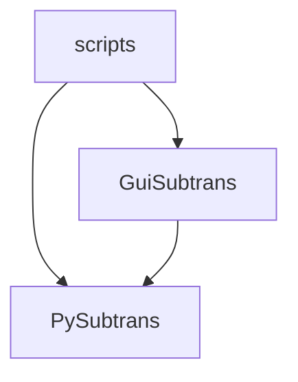

# LLM-Subtrans Architecture



This document helps developers understand where to find code and how components interact when working on the codebase.

## Entry Points

| Script | Purpose |
|--------|---------|
| `scripts/gui-subtrans.py` | Launches GUI, loads persistent settings, initializes translation providers |
| `scripts/llm-subtrans.py` | CLI translator - loads subtitle file, translates using specified provider/model, saves results |

## Module Structure

### PySubtrans (Core Engine)
Contains all subtitle processing, translation logic, and project management. This is where you'll find:
- Translation algorithms and providers
- Project state management
- Settings and configuration
- File format support and parsing

**Key Classes:**
- `Subtitles` – container for subtitle data with thread-safe access patterns
- `SubtitleScene`, `SubtitleBatch` – hierarchical organization splitting files into manageable translation units
- `SubtitleLine` – represents individual subtitles with timing, text, and translation data
- `Options` – centralized settings management
- `SubtitleProject` – orchestrator managing translation sessions and project persistence
- `SubtitleTranslator` – executes translation jobs, handles retries and errors
- `TranslationProvider` – base class for pluggable backends (OpenAI, Anthropic, etc.)
- `SubtitleBuilder` – fluent API for programmatically building subtitle structures
- `SubtitleEditor` – handles mutation operations on subtitle data with thread safety

### Subtitle Format Handling
Subtitle files are processed through a pluggable system:
- `SubtitleFileHandler` implementations read and write specific formats while exposing a common interface.
- `SubtitleFormatRegistry` discovers handlers in `PySubtrans/Formats/` and maps file extensions to the appropriate handler based on priority.
- `SubtitleProject` uses the registry to detect formats from filenames and can convert subtitles when the output extension differs from the source.

### GuiSubtrans (User Interface)
PySide6-based interface using MVVM pattern. Work here for UI features, dialogs, and user interactions.

### Key Classes
- `ProjectDataModel` – State management and synchronization layer
- `ProjectViewModel` – Qt model mapping project data to UI views (scenes → batches → lines)
- `CommandQueue` – executes operations asynchronously with undo/redo support
- `GuiSubtrans/Widgets/*` - Various custom widgets for forms, editors, and views

## Data Organization

### Data Hierarchy
- `Subtitles` – top-level container with subtitle content and metadata, provides thread-safe access to scenes and lines
- `SubtitleScene` – a time-sliced section of subtitles, grouped into batches
- `SubtitleBatch` – groups of lines within a scene, split into chunks for translation
- `SubtitleLine` – individual subtitle with index, timing, text and metadata

### SubtitleProject
Manages translation sessions and project persistence. It orchestrates loading subtitle files, saving/loading `.subtrans` project files (JSON format containing subtitles, translations, and metadata), and coordinates project settings management.

### SubtitleBatcher
Pre-processes subtitles to divide them into scenes and batches ready for translation. Scene detection threshold and maximum batch size are configurable.

### SubtitleBuilder
The `SubtitleBuilder` class provides a fluent API for constructing `Subtitles`.
- Automatic scene and batch organization based on configurable size limits
- Integration with `SubtitleBatcher` for intelligent scene subdivision

### SubtitleEditor
Mutation operations on subtitle data should go through the `SubtitleEditor` class to ensure proper thread safety when adding/removing/merging/splitting scenes, batches and lines.

Also provides methods for preprocessing, auto-batching and data sanitization.

## Translation Process

**SubtitleTranslator** manages the translation pipeline:
- Splits `Subtitles` into scenes and batches for processing
- Builds prompts with context for each batch
- Delegates to `TranslationProvider` clients for API calls
- Handles retries, error management and post-processing
- Emits `TranslationEvents` with progress updates

### TranslationProvider System
- Pluggable base class with providers in `PySubtrans/Providers/` that auto-register
- Each provider exposes available models and creates an appropriate `TranslationClient`
- `TranslationClient` handles API communication specifics (authentication, request format, parsing)
- The provider can also provide a custom `TranslationParser` if a non-standard response format is expected
   
## Command-Line Architecture

The command-line interface provides simple synchronous processing of a source file.

1. **Argument parsing** – allows configuration via command line arguments.
2. **Options creation** – Parsed arguments and environment variables are merged to produce an `Options` instance that configures the translation flow.
3. **Project initialization** – `CreateProject` loads the source subtitles and prepares them for translation, and initialises a `SubtitleTranslator`, optionally reading/writing a project file.
5. **Completion** the resulting translation is saved, and the optional project file is updated.

## GUI Architecture

The GUI is built using PySide6 and follows a Model-View-ViewModel (MVVM) like pattern.

### ProjectDataModel
This class acts as a bridge between the core `SubtitleProject` and the `ProjectViewModel`. It holds the current project, the project options, and the current translation provider. It's responsible for creating the `ProjectViewModel` and for applying updates to it.

### ProjectViewModel
A custom `QStandardItemModel` that serves as the source for the various views in the GUI. It holds a tree of `SceneItem`, `BatchItem`, and `LineItem` objects, which mirror the structure of the `Subtitles` data.

It has an update queue to handle asynchronous updates, ensuring that the GUI is updated in a thread-safe manner.

### Views
The GUI is composed of several views, such as the `ScenesView`, `SubtitleView`, and `LogWindow`, which are all subclasses of `QWidget`. 

These views are responsible for displaying the data from the `ProjectViewModel` and for handling user input.

### Command Queue
GUI operations use the Command pattern for background execution and undo/redo support:

- **CommandQueue** – executes commands on background `QThreadPool`, manages concurrency and synchronisation
- **Commands** – in `GuiSubtrans/Commands/`, encapsulate operations (translation, file I/O, etc.)
- **Undo/Redo** – maintained via `undo_stack` and `redo_stack`

## Settings Management
Application settings are managed through a layered system:

**`SettingsType`** - generic type-safe settings container
- Provides typed getters (`get_str`, `get_int`, `get_bool`) and convenience properties

**`PySubtrans.Options`** 
- application-specific `SettingsType`
- Provides default values for all application settings
- Loads settings from a `settings.json` file
- Import settings from environment variables and command line arguments
- Supports project-specific and provider-specific settings

## GUI Widget Architecture

### The `ModelView`
The central widget for displaying project data is the `GuiSubtrans.Widgets.ModelView`. It is a container widget that uses a `QSplitter` to arrange three main components:

#### `ProjectSettings`
A form for editing project-specific settings. It is displayed when the user clicks on the "Settings" button in the `ProjectToolbar`.

#### ScenesView
A `QTreeView` that displays the scenes and batches from the `ProjectViewModel`. This lets users view the high level status of a translation job.

#### ContentView
A container widget that dynamically adapts based on the selected scene(s) and batch(es), to show:

**`SubtitleView`** individual lines, aligning original and translated content.

**`SelectionView`** provides contextual information and actions.

#### Editors and Dialogs
`GuiSubtrans.Widgets.Editors` contains various widgets for editing scenes, batches, and individual subtitle lines, shown when a user double-clicks on an item in the `ScenesView` or `SubtitleView`. 

### Settings Dialog Architecture

`SettingsDialog` provides access to the global and provider-specific configuration settings.

#### Schema-driven UI
The structure of the `SettingsDialog` is defined by the `SECTIONS` dictionary, which defines the tabs and their contents as a nested dictionary of setting keys and their types along with an optional tooltip. e.g.

```python
'General': {
    'ui_language': (str, _("The language of the application interface")),
    'target_language': (str, _("The default language to translate the subtitles to")),
    # ...
},
```

This structure is used to build the form, with the `OptionsWidgets.CreateOptionWidget` factory function creating an appropriate widget for each setting based on its type.

#### Conditional visibility
Settings can be conditionally visible on other settings, using a data-driven system defined by the `VISIBILITY_DEPENDENCIES` property.

#### Provider pluggability
The "Provider Settings" tab dynamically populates with options specific to the selected translation provider. Each provider defines its own settings schema via a virtual `GetOptions` method, which is then used to populate the form.

## Real-time UI Updates
Translation operations can take minutes, but users need feedback and the ability to continue working.

### ModelUpdate Pattern
Commands can send incremental UI updates during execution via `ModelUpdate` objects.

For example, `TranslateSceneCommand` subscribes to `SubtitleTranslator` events. Each time a batch completes, it emits a `ModelUpdate` with the translation data.

1. Command creates `ModelUpdate` and sends to `ProjectDataModel`
2. `ProjectDataModel` queues update and emits `updatesPending` signal  
3. `ProjectViewModel.ProcessUpdates()` applies changes on main thread
4. Views automatically reflect updated data through Qt's model/view system

This pattern enables real-time feedback during long operations while maintaining thread safety and separation between business logic and UI.

## Translation Provider Architecture
The application supports multiple translation services through a provider system.

### TranslationProvider (Configuration Layer)
Each `TranslationProvider` subclass serves as the registry entry for a translation service and offers:

- **`available_models`**: property containing available models that can be selected
- **GetTranslationClient**: creates an appropriate client for API communication
- **GetOptions**: Defines provider-specific options (API key, endpoints, etc.)

### TranslationClient (Communication Layer)  
The `TranslationClient` defines the API communication interface:

- **`BuildTranslationPrompt()`** – constructs the prompt sent to the translation service
- **`RequestTranslation()`** – handles the API call and returns a `Translation` object
- **`GetParser()`** – returns a `TranslationParser` to extract translated text from the response

### Adding New Providers
Dynamic discovery: drop a new module in `PySubtrans/Providers/` with a `TranslationProvider` subclass, and it automatically registers at startup. No other code changes needed - the provider and its settings will be added to `SettingsDialog`.

### Prompt Construction and Response Parsing
The specific format for translation requests can vary by provider and responses can be inconsistent, so two helper classes exist to manage the differences between capabilities and expectations.

**`TranslationPrompt`** builds context-rich prompts by combining:
- User instructions and translation guidelines
- Subtitle lines to be translated  
- Scene/batch summaries and character information for context
- Configurable templates

**`TranslationParser`** extracts translations from LLM responses:
- Uses multiple regex patterns to attempt to extract translated lines from the response
- Matches extracted translations back to source subtitle lines
- Extracts additional metadata
- Validates results (line length, formatting rules) and triggers retries if needed

## Extending the System

- **New file formats** → `PySubtrans/` (add file handler, extend `SubtitleFileHandler`)
- **Translation providers** → `PySubtrans/Providers/` (subclass `TranslationProvider` and `TranslationClient`)
- **GUI features** → `GuiSubtrans/Widgets/` (new views/dialogs), `GuiSubtrans/Commands/` (new operations)
- **Settings** → update `Options` schema, add to `SettingsDialog.SECTIONS`
- **Background operations** → implement `Command` pattern in `GuiSubtrans/Commands/` for thread safety and undo support

**Key principles:**
- All operations that modify project data must go through the `CommandQueue` to maintain thread safety and undo/redo functionality.
- All subtitle mutations should use a `SubtitleEditor` for lock management.
