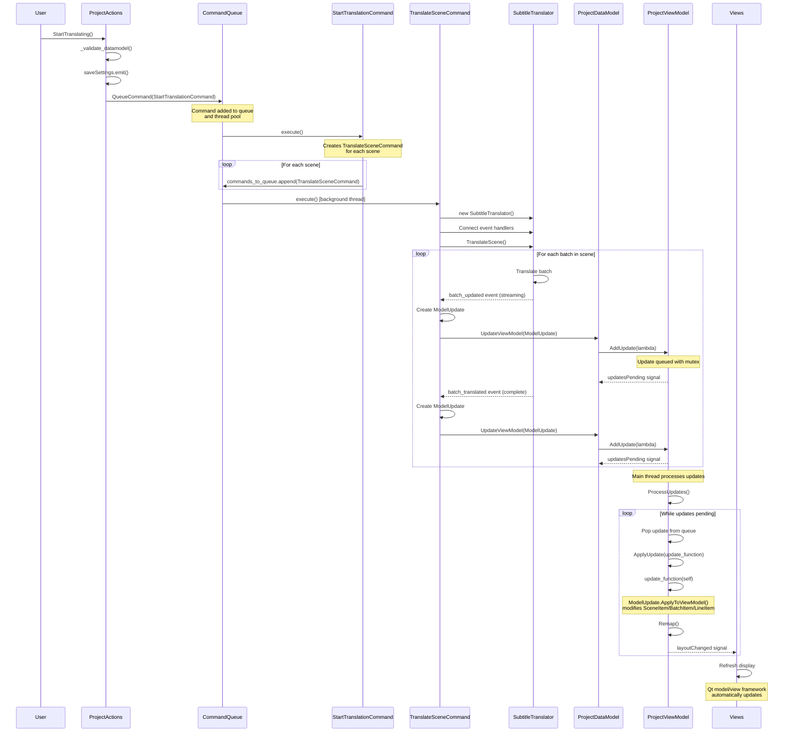
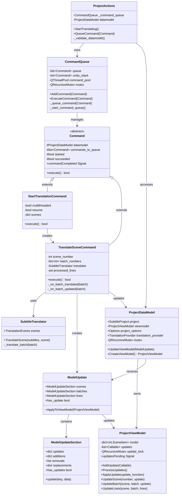
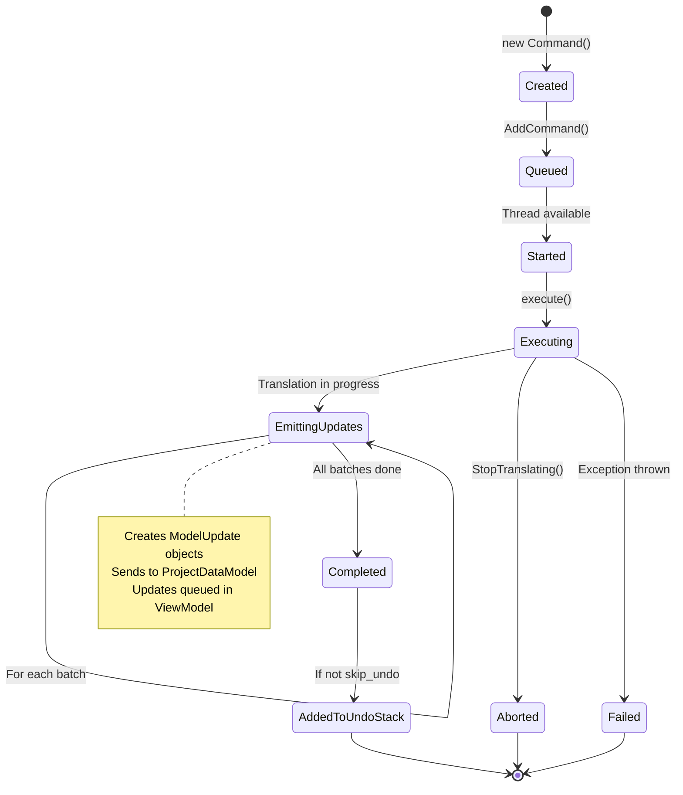
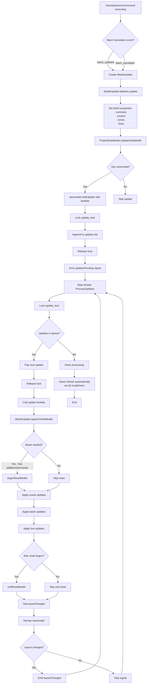
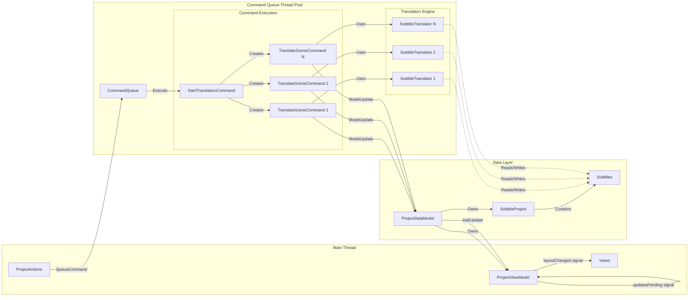
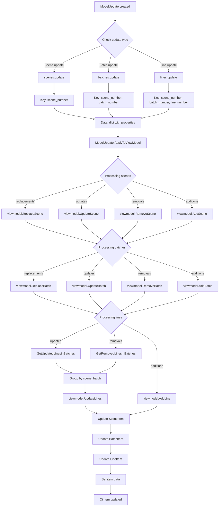

# Translation Request Flow

This document provides detailed mermaid diagrams showing how a translation request flows through the LLM-Subtrans GUI application, from user action to UI update.

## Overview

The translation flow follows this high-level path:
1. User triggers translation via `ProjectActions.StartTranslating()`
2. Command is queued in `CommandQueue`
3. Commands execute on background threads
4. Commands emit `ModelUpdate` objects during execution
5. `ProjectDataModel` receives and queues updates
6. `ProjectViewModel` processes updates on main thread
7. Qt views automatically refresh to show changes

## 1. Sequence Diagram: Full Translation Flow



## 2. Class Diagram: Key Components



## 3. State Diagram: Command Lifecycle



## 4. Data Flow Diagram: ModelUpdate Processing



## 5. Component Interaction Diagram



## 6. Detailed ModelUpdate Processing



## Key Implementation Details

### Thread Safety

1. **CommandQueue** uses `QRecursiveMutex` to protect the command queue and undo/redo stacks
2. **ProjectViewModel** uses `QRecursiveMutex` to protect the updates list
3. **ProjectDataModel** uses `QRecursiveMutex` for thread-safe access to project data
4. Updates are queued on background threads but processed on the main thread via signals

### Update Batching

- **Streaming updates** (`batch_updated` events) send incremental line translations as they arrive
- **Complete updates** (`batch_translated` events) send full batch data including metadata
- `TranslateSceneCommand` tracks processed lines to avoid redundant updates

### Model Reset Strategy

- **Nuclear option**: When `ModelUpdate` contains additions or removals, the entire model is reset
- This prevents Qt crashes from dangling indexes
- For simple updates (property changes), items are updated in place without reset

### Signal Flow

1. `CommandQueue.commandExecuted` - when command completes
2. `ProjectViewModel.updatesPending` - when updates are queued
3. `ProjectViewModel.layoutChanged` - when structure changes require view refresh
4. Qt's model/view framework automatically refreshes views on these signals

## Common Patterns

### Pattern 1: Simple Property Update

```python
# In TranslateSceneCommand._on_batch_translated
update = ModelUpdate()
update.batches.update((batch.scene, batch.number), {
    'summary': batch.summary,
    'context': batch.context
})
self.datamodel.UpdateViewModel(update)
```

### Pattern 2: Line Translation Updates

```python
# Update multiple lines in a batch
update = ModelUpdate()
update.batches.update((batch.scene, batch.number), {
    'lines': {
        line.number: {'translation': line.text}
        for line in batch.translated
    }
})
self.datamodel.UpdateViewModel(update)
```

### Pattern 3: Scene-level Update

```python
# Update scene summary after translation
model_update = self.AddModelUpdate()
model_update.scenes.update(scene.number, {
    'summary': scene.summary
})
```

## Error Handling

- **CommandError** exceptions stop command execution and set `terminal = True`
- **TranslationAbortedError** marks command as aborted and terminal
- **TranslationImpossibleError** logs error and marks command as terminal
- Terminal commands prevent subsequent queued commands from executing
- Undo stack is cleared when non-undoable commands execute

## Performance Considerations

1. **Multithreading**: Multiple scenes can be translated in parallel when `multithreaded=True`
2. **Update batching**: ViewModel queues updates and processes them in sequence on main thread
3. **Incremental updates**: Streaming updates provide real-time feedback without blocking
4. **Smart remapping**: ViewModel only remaps when structure changes occur
5. **Mutex granularity**: Fine-grained locking minimizes contention between threads
